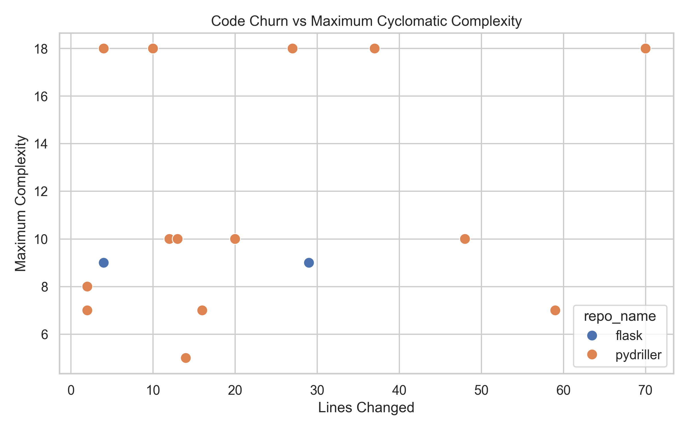

# MSR Bug-Fix Analysis Pipeline

Your software's commit history contains valuable information, but extracting it can take a lot of time. This pipeline is an automated tool that extracts bug-fix commits from open-source Python projects and analyzes their code complexity.

## Highlights

Here are the main benefits of using this tool:
*   **Smart filtering:** Automatically finds real bug fixes and ignores irrelevant changes.
*   **Measures code complexity:** Calculates how complex the modified code is using AST rules.
*   **Two ways to run:** Works directly online using GitHub URLs or locally on your computer.
*   **Ready-to-use data:** Outputs clean, merged CSV files and helpful charts to show your results.

## Overview

Finding bug fixes in large projects and understanding how hard they were to resolve is usually a manual and slow process. This tool solves that problem by automating the workflow. 

### Key Features
*   **Smart Bug-Fix Detection:** The tool looks for specific words (like "fix" or "bug") to find the right commits and ignores false matches (like updating the README). This ensures you only get data about real software bugs.
*   **Two Ways to Run:** You can run the tool locally on downloaded repositories or online using direct GitHub links.
*   **Code Complexity Check:** It uses the `radon` library to check Python files and calculates the average complexity, the maximum complexity, and the number of highly complex functions (CC > 5) changed during the fix.

### Current Limitations
While this tool is powerful, there are a few things to keep in mind:
*   **Python Only:** Currently, the pipeline only analyzes Python files (`.py`).
*   **Commit Classification:** It uses text patterns to find fixes, which means it might miss bug fixes if developers do not follow common commit message rules.
*   **Online Mode:** This mode requires internet access and might run slower when processing very large repositories.

### How It Works

```text
┌─────────────────────────────────────────────────────────────────────┐
│                        PHASE 1: DATA COLLECTION                     │
│  ┌──────────────────┐   ┌──────────────────┐   ┌──────────────────┐ │
│  │        Get       │   │        Find      │   │       Clean      │ │
│  │      Commits     │─▶ │      Bug Fixes   │─▶ │      the Data    │ │
│  │    (PyDriller)   │   │    (Text Rules)  │   │                  │ │
│  └──────────────────┘   └──────────────────┘   └──────────────────┘ │
└─────────────────────────────────────────────────────────────────────┘
                                  │
                                  ▼
┌─────────────────────────────────────────────────────────────────────┐
│                      PHASE 2: CALCULATING DATA                      │
│  ┌──────────────────┐   ┌──────────────────┐                        │
│  │       Count      │   │      Measure     │   ┌──────────────────┐ │
│  │   Changed Lines  │─▶ │  Code Complexity │─▶ │      Combine     │ │
│  │  (Added/Deleted) │   │      (Radon)     │   │     the Data     │ │
│  └──────────────────┘   └──────────────────┘   └──────────────────┘ │
└─────────────────────────────────────────────────────────────────────┘
                                  │
                                  ▼
┌─────────────────────────────────────────────────────────────────────┐
│                  PHASE 3: CHARTS & VISUALIZATION                    │
│                         ┌──────────────────┐                        │
│                         │    Create Charts │                        │
│                         │    (Matplotlib & │                        │
│                         │      Seaborn)    │                        │
│                         └──────────────────┘                        │
└─────────────────────────────────────────────────────────────────────┘
```

## Usage Instructions

The easiest way to use this software is through the main pipeline runner.

### Online Mode (Using GitHub URLs)
You can use the tool directly on online repositories in two simple steps:

First, collect the raw commits by providing the GitHub links. You can also set a maximum number of commits to process:
```bash
python src/collect_multiple_repos.py --repos [https://github.com/psf/requests.git](https://github.com/psf/requests.git) [https://github.com/pallets/flask.git](https://github.com/pallets/flask.git) --max-commits 100
```

Next, run the main pipeline. The tool will automatically download the necessary files from GitHub to calculate the complexity metrics:
```bash
python run_pipeline.py --mode online
```

### Local Mode (Using downloaded folders)
If you already have the projects cloned on your computer, you can run everything in one step. Just point the tool to your main folder:
```bash
python run_pipeline.py --mode local --repo-dir "F:/repos/"
```

## Output Files

When the pipeline finishes, it saves several CSV files and charts in the `data/` and `plots/` folders:

| File Name | Description |
| :--- | :--- |
| `multi_repo_commits.csv` | All the raw commits found in the repositories. |
| `bugfix_commits.csv` | A filtered list containing only bug-fix commits. |
| `bugfix_with_lines.csv` | Bug fixes with information about added and deleted lines. |
| `bugfix_complexity.csv` | Code complexity numbers for the Python files. |
| `final_enriched_bugfixes.csv` | The final file that contains all the merged data. |

## What Can You Learn From the Data?

This pipeline helps you answer practical questions like:
*   **Which bug fixes are the most complex?** Look at the `max_complexity` and `high_complexity_functions_count` columns to find the hardest tasks.
*   **Do bug fixes usually change many files?** Check the `files_changed_count` column to see typical maintenance patterns.
*   **Is there a correlation between code churn and complexity?** The tool automatically generates correlation plots to show if changing more lines means dealing with harder code.
*   **Which project has the most complex bug fixes?** Use the repository comparison chart to evaluate different open-source projects.

## 🔍 Example Data

Here is a real example of the data this tool produces. It comes from the PyDriller project (Commit: `d9ac435542e884c...`). It shows how the tool successfully captures all the important details of a bug fix:

```json
{
    "repo_name": "pydriller",
    "commit_hash": "d9ac435542e884c4e2035c384fbf4a00cc28be89",
    "message": "- fixed bug for the parameter 'single': in case the commit was not present...",
    "author": "ishepard",
    "files_changed_count": 5,
    "python_files_count": 5,
    "lines_added": 33,
    "lines_deleted": 4,
    "avg_complexity": 3.80,
    "max_complexity": 18.0,
    "high_complexity_functions_count": 18
}
```

> **Note:** This specific bug fix changed 18 highly complex functions, and the maximum complexity reached 18.0. This is very useful information to see which bug fixes are the hardest to manage.

## Visual Insights

The pipeline automatically generates charts in the `plots/` folder. 
Here is the most important visualization showing the relationship between 
code churn and complexity:



*This scatter plot shows that as the number of lines changed increases, 
the complexity of bug-fix commits tends to rise.*

>  **All visualizations** including complexity distribution, repository comparison, 
> and top complex commits are automatically saved in the [`plots/`](plots/) folder.

---

## Prerequisites

Before you start, make sure you have:
*   Python 3.8 or higher installed on your system
*   Git (only needed for local mode)
*   Internet connection (only needed for online mode)
*   Basic familiarity with the command line or terminal

## Installation Instructions

To set the project up, open your terminal and follow these steps:

Clone the repository to your computer:
```bash
git clone [https://github.com/yeganejhi/Mining-Sreach-Repositories](https://github.com/yeganejhi/Mining-Sreach-Repositories)
```

Create and activate a virtual environment (highly recommended):
```bash
python -m venv venv
source venv/bin/activate  # On Windows, use: venv\Scripts\activate
```

Install the required packages:
```bash
pip install pandas pydriller requests radon GitPython matplotlib seaborn pytest
```

## Testing

This project includes automated tests to check if the main parts are working correctly. After installing, you can run:

```bash
# Run all tests
pytest tests/
```

What the tests check:
```text
 test_bugfix_detection: Makes sure the tool finds real bugs and ignores typo fixes.
 test_complexity: Checks if the code reading and complexity math are correct.
 test_files: Ensures the tool only looks at Python files and ignores others (like .md or .js).
```

## Feedback & Contributing

If you find this tool helpful, or if you have suggestions to make it better, please start a **Discussion** or open an **Issue**!

When building open-source software, building a community is important. If you find a bug, want to add a new feature, or just want to improve the documentation, feel free to submit a **Pull Request**. All contributions are welcome.
