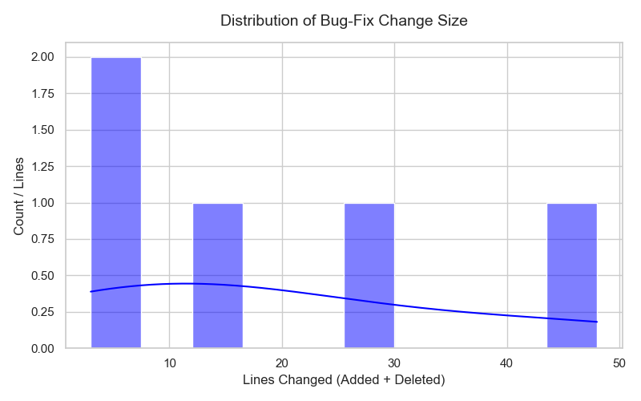
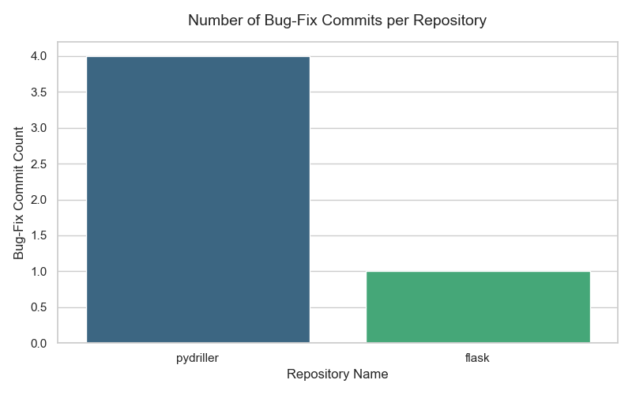

# MSR-Pipeline: Automated Bug-Fix Mining and Metadata Enrichment

[](https://www.python.org/)
[](LICENSE)
[](https://github.com/)

A pipeline for mining, cleaning, and enriching bug-fix commit data from GitHub repositories. It combines Git metrics (lines added/deleted) with AST-based code analysis to measure cyclomatic complexity.

---

## Highlights

- No need to clone repos locally — works with remote streaming
- Tracks both code churn and structural complexity
- Can run fully online or offline if you have local repos
- Generates correlation plots and stats automatically

---

## Overview

This project started as a way to understand how code complexity affects the way people fix bugs. The idea was to pull commit history from GitHub, filter out bug-fixing commits, and then look at two things: how much code changed (churn) and how complex the code was before the fix (cyclomatic complexity).

The pipeline runs in stages — from raw commit mining to cleaning, merging, and finally generating plots and correlation stats.

### Why This Matters for Graduate Research

I'm applying for grad school in software engineering and wanted to put together a project that touches both code analysis and empirical research. Most existing tools either require cloning entire repos (which takes forever) or don't dig into actual code structure. This pipeline tries to strike a balance — you get AST-level metrics without needing to store everything locally.

```text
[Remote GitHub Repos] --> 1. collect_multiple_repos.py (Raw Mining)
                               |
                               v
                           2. extract_bugfix_commits.py (Regex Filter)
                               |
                               v
                           3. extract_clean_comments.py (UTC/Text Prep)
                               |
                               v
                           4. debug_line_added_deleted.py (Hybrid Churn)
                               |
                               v
                           5. merge_bugfix_data.py (Integration Part I)
                               |
                               v
                           6. compute_complexity.py (AST Radon Engine)
                               |
                               v
                           7. merge_pipeline_data.py (Final Consolidation)
                               |
                               v
                    +---------+---------+
                    |                   |
                    v                   v
           8. eda_analysis.py    9. visualization.py
          (Statistical Models)  (Graphical Charts)
```

## What I Wanted to Find Out

I had three main questions going into this:

1. How strongly does code churn correlate with complexity in bug-fix commits?
2. Does this relationship change depending on the repository (e.g., smaller vs. larger projects)?
3. Can we get useful AST metrics without cloning the whole repo?

## Some Problems I Ran Into

**Timezone mess**

Commits come from all over the world, so timestamps are all over the place. I ended up normalizing everything to UTC using Pandas so I wouldn't have mismatched times in the final dataset.

**API rate limits**

Grabbing diffs from GitHub directly can be slow and sometimes hits rate limits. I used PyDriller's streaming generator to pull data incrementally instead of dumping everything at once.

**AST needs local files**

Radon (the complexity tool) expects to read files from disk. But if you're running in online mode, you don't have the source code locally. So I added a hybrid fallback — fetch raw file contents from GitHub API when online, or use os.walk to find files when running locally.

## What the Pipeline Produces

The pipeline generates a structured dataset with:

- **Process metrics:** lines added, lines deleted, total churn per commit
- **Product metrics:** cyclomatic complexity per function, max complexity, average complexity
- **Metadata:** normalized timestamps (UTC) and cleaned commit messages

You also get:

- Descriptive stats (mean, median, std dev) for churn and complexity
- Correlation matrices (Pearson + Spearman)
- Histograms with KDE overlays showing how patch sizes are distributed
- Comparative bar charts across multiple repos

All plots are saved in the `plots/` directory.

## Known Limitations

| Limitation | Why it matters | What I did about it |
|------------|----------------|----------------------|
| Python files only | Can't analyze other languages yet | Kept the architecture modular so adding Java/JS later is easier |
| Relies on commit messages | Might miss bugfixes that aren't tagged clearly | Made the regex patterns configurable |
| GitHub API rate (5k/hour) | Can't mine huge repos in one go | Added a local mode for large-scale runs |
| Correlation != causation | Can't claim complexity *causes* smaller fixes | Used it for hypothesis generation, not confirmation |

## Quick Start (30 seconds)

```bash
git clone https://github.com/yourusername/msr-pipeline.git
cd msr-pipeline && pip install -r requirements.txt

python src/collect_multiple_repos.py --repos flask --max-commits 5
python src/extract_bugfix_commits.py
python src/compute_complexity.py --mode online
python src/visualization.py
```

Check `data/` for CSV outputs and `plots/` for generated figures.

## Installation

You'll need Python 3.8+ and Git.

```bash
git clone https://github.com/yourusername/msr-pipeline.git
cd msr-pipeline
pip install -r requirements.txt
```

Dependencies: pandas, pydriller, radon, requests, matplotlib, seaborn.

## Running the Pipeline

**Option A: Online Mode** (no local cloning)

```bash
python src/collect_multiple_repos.py --repos https://github.com/pallets/flask https://github.com/ishepard/pydriller
python src/extract_bugfix_commits.py
python src/extract_clean_comments.py
python src/debug_line_added_deleted.py --mode online
python src/merge_bugfix_data.py
python src/compute_complexity.py --mode online
python src/merge_pipeline_data.py
python src/eda_analysis.py
python src/visualization.py
```

**Option B: Local Mode** (faster if repos are already on your machine)

```bash
# Make sure your repos are in a directory, e.g., F:/repos/
python src/collect_multiple_repos.py --repos flask pydriller
python src/extract_bugfix_commits.py
python src/extract_clean_comments.py
python src/debug_line_added_deleted.py --mode local --repo-dir "F:/repos/"
python src/merge_bugfix_data.py
python src/compute_complexity.py --mode local --repo-dir "F:/repos/"
python src/merge_pipeline_data.py
python src/eda_analysis.py
python src/visualization.py
```
## Sample Output

Here are some example plots generated by the pipeline:



*Figure 1: Distribution of lines changed (added + deleted) per bug-fix commit*



*Figure 2: Number of bug-fix commits across repositories*

## Contributing

If you're using this for research or have ideas on how to make it better, feel free to open an issue or start a discussion.

*Built for research and experimentation. Feedback welcome.*
